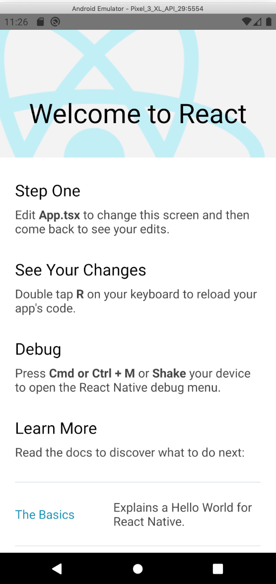

## Intro

In this post, we'll create a React Native project, using [AWS Amplify](https://aws.amazon.com/amplify/) to allow our users to log in with their Google accounts.

Amplify helps you add things like authentication, APIs, databases, hosting, and much more to your project by doing the heavy lifting for you.

This tutorial will explain how to use Amplify's Auth module with a Typescript React Native app. It'll cover both React Native CLI and Expo.

I'm writing this blog post because when I tried to implement Amplify Auth in my React Native app, I ran into some problems. Through this tutorial, I hope I can make it easier for both you and future me to get started!

For this tutorial, we'll be using [React Native CLI](https://reactnative.dev/docs/getting-started). I'll tell you when there's something specific to Expo or to React Native CLI.

## Creating a new React Native project

First, we'll scaffold a new React Native app. To do so, we'll use the official tutorial for React Native CLI Quickstart. I'm using a Mac and Android phone, but you can select whichever platforms apply to you.

1. Scaffold a new project with Expo or the React Native CLI: [https://reactnative.dev/docs/getting-started](https://reactnative.dev/docs/getting-started), either Expo or React Native CLI is fine. Expo is easier to get started with whilst React Native CLI offers more freedom (and support for native modules).
    - When running `expo init`, you can pick a TypeScript template. If you're using React Native CLI, you'll want to use the following command: `npx react-native init MyTSProject --template react-native-template-typescript` 
2. You should now have a folder with the same name as you entered while scaffolding your app. From here on out we'll call it "myapp".
3. Start an emulator, Expo has tutorials for [IOS](https://docs.expo.io/versions/latest/workflow/ios-simulator/) and [Android](https://docs.expo.io/versions/v36.0.0/workflow/android-studio-emulator/).
4. Now, depending on the platform, either run `npm run android` or `npm run ios`.

You should now see something like this:



Phew. We've gotten this far! Now let's add Amplify!

## Adding AWS Amplify

**Before following these steps, install Amplify first. To do that, you can follow these steps: [https://aws-amplify.github.io/docs/cli-toolchain/quickstart?sdk=js](https://aws-amplify.github.io/docs/cli-toolchain/quickstart?sdk=js)**

1. At the root of your project, run `amplify init`.
2. Specify the name of your project, the default is usually fine.
3. Specify a name for your environment, since this is your local development environment, enter "develop".
4. Pick your default editor, if it's not listed, pick "none".
5. Choose "javascript"
6. Choose "react-native"
7. For source, distribution paths, build command, and start command, you can use the defaults.
8. When asked if you want to use an AWS profile, choose "Y"
9. Either create a new one or choose any option on the list.

You should now be greeted by this message:

```
⠧ Initializing project in the cloud...

CREATE_IN_PROGRESS DeploymentBucket             AWS::S3::Bucket            Tue Mar 03 2020 11:45:13 GMT+0100 (Central European Standard Time) Resource creation Initiated
CREATE_IN_PROGRESS UnauthRole                   AWS::IAM::Role             Tue Mar 03 2020 11:45:13 GMT+0100 (Central European Standard Time) Resource creation Initiated
CREATE_IN_PROGRESS AuthRole                     AWS::IAM::Role             Tue Mar 03 2020 11:45:13 GMT+0100 (Central European Standard Time) Resource creation Initiated
CREATE_IN_PROGRESS AuthRole                     AWS::IAM::Role             Tue Mar 03 2020 11:45:12 GMT+0100 (Central European Standard Time)                            
CREATE_IN_PROGRESS UnauthRole                   AWS::IAM::Role             Tue Mar 03 2020 11:45:12 GMT+0100 (Central European Standard Time)                            
CREATE_IN_PROGRESS DeploymentBucket             AWS::S3::Bucket            Tue Mar 03 2020 11:45:12 GMT+0100 (Central European Standard Time)                            
CREATE_IN_PROGRESS amplify-myapp-develop-114507 AWS::CloudFormation::Stack Tue Mar 03 2020 11:45:09 GMT+0100 (Central European Standard Time) User Initiated             
⠏ Initializing project in the cloud...

CREATE_COMPLETE UnauthRole AWS::IAM::Role Tue Mar 03 2020 11:45:27 GMT+0100 (Central European Standard Time) 
CREATE_COMPLETE AuthRole   AWS::IAM::Role Tue Mar 03 2020 11:45:27 GMT+0100 (Central European Standard Time) 
⠦ Initializing project in the cloud...

CREATE_COMPLETE DeploymentBucket AWS::S3::Bucket Tue Mar 03 2020 11:45:34 GMT+0100 (Central European Standard Time) 
⠇ Initializing project in the cloud...

CREATE_COMPLETE amplify-myapp-develop-114507 AWS::CloudFormation::Stack Tue Mar 03 2020 11:45:36 GMT+0100 (Central European Standard Time) 
✔ Successfully created initial AWS cloud resources for deployments.
✔ Initialized provider successfully.
Initialized your environment successfully.

Your project has been successfully initialized and connected to the cloud!

Some next steps:
"amplify status" will show you what you've added already and if it's locally configured or deployed
"amplify add <category>" will allow you to add features like user login or a backend API
"amplify push" will build all your local backend resources and provision it in the cloud
“amplify console” to open the Amplify Console and view your project status
"amplify publish" will build all your local backend and frontend resources (if you have hosting category added) and provision it in the cloud

Pro tip:
Try "amplify add api" to create a backend API and then "amplify publish" to deploy everything
```

You've successfully added AWS Amplify! 🚀️

## Adding Amplify Auth

1. An the root of your project, run `amplify auth`.
2. Choose "Default configuration with Social Provider (Federation)".
3. Choose "Username".
4. Choose "No, I am done.".
5. Pick any prefix, the default is fine.
6. For the redirect signin URI, enter `myapp://` where myapp is the name of your app.
7. One redirect signin URI is fine, enter N.
8. For redirect signout URI, also enter `myapp://`. Again, replace myapp the name of your app.
9. One redirect signout URI is fine, enter N. 
10. Select the auth providers you'd like to support, you can move up/down with arrow keys and select options with your "space" key. When you're done choosing, hit "enter". For this tutorial we're going to pick "Google".
11. You'll notice AWS asking you for your Google OAuth credentials.

### Getting Google OAuth credentials


