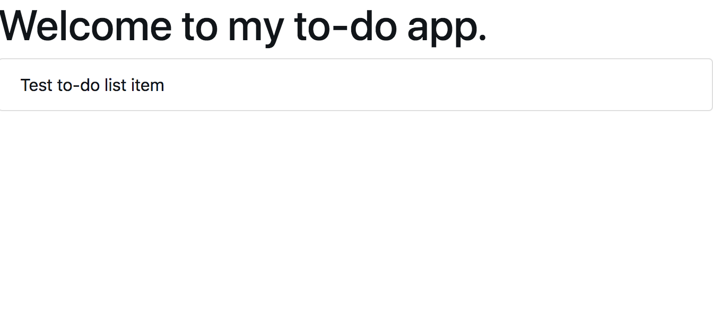

import CodeSandbox from "../../src/components/CodeSandbox";

# [WIP] Using TypeScript with React

In this post I'll be showing you how to build your first TypeScript to-do app. If you've used React with TypeScript before this tutorial probably isn't for you. To keep things simple I'll mainly be focussing on React itself.

Inside `src/` you'll see folders with names that correspond to headers in this tutorial. Check inside for example code!

## Getting started

For this tutorial we'll be using [create-react-app](https://reactjs.org/docs/create-a-new-react-app.html#create-react-app). To get started run the following commands in your terminal; `npx create-react-app todoApp —typescript`, this will scaffold a new TypeScript React app. _This could take a while._

When it's done you'll have the following file structure;

- README.md
- node_modules
- package-lock.json
- package.json
- public - favicon.ico - index.html - manifest.json
- src - App.css - App.test.tsx - App.tsx - index.css - index.tsx - logo.svg - react-app-env.d.ts - serviceWorker.ts
- tsconfig.json

To start a development server that automatically reloads your browser when changing code, run the following commands in your terminal;

```sh
cd todoApp
npm start
```

Your default browser should open automatically. If it doesn't, open your browser and go to `http://localhost:3000` manually.

You'll see the following screen:

<CodeSandbox
  title="Getting started"
  url="https://codesandbox.io/embed/5klroqv26l"
/>

Save for the SVG that's not rendering, but that's not important.

## Cleaning up

Before we get started building something, let's clean up some files we won't be needing for this tutorial.

Delete the following files;

- App.css
- App.test.tsx
- App.tsx
- index.css
- logo.svg

You'll notice you get a `ModuleNotFoundError` error. We'll fix that in the next step.

## Creating your first component

Let's create your first component!

Inside the project create the following file; `src/components/App.tsx` with the following code;

```jsx
import React from "react";

const App = () => {
  return <h1>Welcome to my to-do app</h1>;
};

export default App;
```

Remember the error I told you about? To fix that, replace the code inside `index.tsx` with

```typescript jsx
import React from "react";
import ReactDOM from "react-dom";
import App from "./components/App";
import * as serviceWorker from "./serviceWorker";

ReactDOM.render(<App />, document.getElementById("root"));

// If you want your app to work offline and load faster, you can change
// unregister() to register() below. Note this comes with some pitfalls.
// Learn more about service workers: https://bit.ly/CRA-PWA
serviceWorker.unregister();
```

Your browser should automatically refresh to show the following;

<CodeSandbox
  title="Creating your first component"
  url="https://codesandbox.io/embed/l4w63r72om"
/>

## Adding some styling

To make our to-do app look usable we'll be using Bootstrap. For this tutorial we'll be using their CDN because styling is not our focus right now. To read about how to properly styling your app I suggest you keep your eyes open on this blog for when that post arrives!

To install Bootstrap we'll be following their tutorial; [https://getbootstrap.com/docs/4.3/getting-started/introduction/](https://getbootstrap.com/docs/4.3/getting-started/introduction/).

Since we won't be using any JavaScript plugins all you have to do is the following;

1. append `<link rel="stylesheet" href="https://stackpath.bootstrapcdn.com/bootstrap/4.3.1/css/bootstrap.min.css" integrity="sha384-ggOyR0iXCbMQv3Xipma34MD+dH/1fQ784/j6cY/iJTQUOhcWr7x9JvoRxT2MZw1T" crossorigin="anonymous">` to `public/index.html` in `<head></head>`.

Your `public/index.html` should now contain the following;

```html
<!DOCTYPE html>
<html lang="en">
  <head>
    <meta charset="utf-8" />
    <link rel="shortcut icon" href="%PUBLIC_URL%/favicon.ico" />
    <meta
      name="viewport"
      content="width=device-width, initial-scale=1, shrink-to-fit=no"
    />
    <meta name="theme-color" content="#000000" />
    <!--
      manifest.json provides metadata used when your web app is installed on a
      user's mobile device or desktop. See https://developers.google.com/web/fundamentals/web-app-manifest/
    -->
    <link rel="manifest" href="%PUBLIC_URL%/manifest.json" />
    <!--
      Notice the use of %PUBLIC_URL% in the tags above.
      It will be replaced with the URL of the `public` folder during the build.
      Only files inside the `public` folder can be referenced from the HTML.

      Unlike "/favicon.ico" or "favicon.ico", "%PUBLIC_URL%/favicon.ico" will
      work correctly both with client-side routing and a non-root public URL.
      Learn how to configure a non-root public URL by running `npm run build`.
    -->
    <title>React App</title>

    <link
      rel="stylesheet"
      href="https://stackpath.bootstrapcdn.com/bootstrap/4.3.1/css/bootstrap.min.css"
      integrity="sha384-ggOyR0iXCbMQv3Xipma34MD+dH/1fQ784/j6cY/iJTQUOhcWr7x9JvoRxT2MZw1T"
      crossorigin="anonymous"
    />
  </head>
  <body>
    <noscript>You need to enable JavaScript to run this app.</noscript>
    <div id="root"></div>
    <!--
      This HTML file is a template.
      If you open it directly in the browser, you will see an empty page.

      You can add webfonts, meta tags, or analytics to this file.
      The build step will place the bundled scripts into the <body> tag.

      To begin the development, run `npm start` or `yarn start`.
      To create a production bundle, use `npm run build` or `yarn build`.
    -->
  </body>
</html>
```

Notice the `<Link></Link>` tag inside `<head></head>`.

You won't notice much different right away. We'll be using Bootstrap's classes to style our components from now on.

## Defining the domain

Looking at our design we'll need the following components;

1. A to-do list, you know, to render to-do's
2. A to-do component, this will represent one to-do
3. A form to create a new to-do
   1. A submit button
   2. An input to write our to-do in

With that out of the way let's think about our domain for this app; What entities do we have? For our to-do app all we really need is a `Todo` entity. Let's create an `interface` for it.

Interfaces allow us to specify what data we need and what it looks like. You can define an interface of any data you need. This includes properties, state, api responses and anything in between. By defining an interface you get advanced autocompletions and static type checking. What is means is that TypeScript can tell you if you mistakenly add the wrong data to a component or if you're trying to use a `string` property as a `number` before even running your app.

The autocompletions are really neat as well. Most bigger JavaScript packages are written in TypeScript and thus contain types. What this means is that your editor can warn you if you're using a package in the wrong way and it can tell you all parameters a method expects in a package. This also works for components; you can now be warned about using the wrong properties of a component before you even run your app.

**Creating your first interface**

Create the following file; `src/interfaces/Todo.ts`, notice the file extension is `.ts` instead of `.tsx`, since it won't contain any `JSX` (it will be plain TypeScript) you don't have to use `.tsx`. It's still possible to use `tsx` if you like but as I said, it's not required.

Our to-do will have the following fields;

1. name
2. finished

`name` will be what we render inside the list, we'll use `finished` to determine if we've finished the to-do or not.

An example to-do would look like this;

```json
{
  "name": "My example to-do",
  "finished": false
}
```

As you can see `name` is a `string` and `finished` is a `boolean`.

Using this information we end up with the following interface;

```typescript
interface Todo {
  task: string;
  finished: boolean;
}
```

Put the following code inside `src/interfaces/Todo.ts`;

```typescript
export interface Todo {
  task: string;
  finished: boolean;
}
```

Now when we specify that a component requires a `Todo` or an `array` of `Todos` we'll get an error if we forget to add a task or whether the to-do is finished or not.

## Creating static components

Let's start building static components, they'll show what the app is going to look like but they won't be interactive yet. This is a good starting point to create a simple demo using static data and to get a feel for how your app is going to work.

Let's start with our simple button.

Create the following file: `src/components/TodoList.tsx` with the following code;

```tsx
import React from "react";

const TodoList = () => {
  return (
    <ul>
      <li>Our first to-do</li>
    </ul>
  );
};

export default TodoList;
```

Right now we have no way to see what we're actually building. For now, replace the contents of `src/components/App.tsx` with the following code;

```tsx
import React from "react";
import TodoList from "./TodoList";

const App = () => {
  return (
    <div>
      <h1>Welcome to my to-do app.</h1>
      <TodoList />
    </div>
  );
};

export default App;
```

You'll notice we've added the following:

```tsx
import TodoList from "./TodoList";
```

this `imports` the component we just created into the `App` component.

```tsx
<TodoList />
```

This renders our new component. You should now see something like this:


You'll notice there is some base styling applied because we added Bootstrap.

Now, whenever we change the code inside `src/components/TodoList.tsx` the page will automatically refresh so we can see the latest version of our app.

As we can see here; [https://getbootstrap.com/docs/3.4/components/#list-group](https://getbootstrap.com/docs/3.4/components/#list-group) Bootstrap has styling we can use for our list to make it look better. In `src/components/TodoList.tsx` replace

```tsx
<ul>
  <li>Our first to-do</li>
</ul>
```

with the following;

```tsx
<ul className="list-group">
  <li className="list-group-item">Our first to-do</li>
</ul>
```

You'll notice we've added the `list-group` and `list-group-item` `classNames`.

Typically you'd create a component for a single to-do in a list as well. To do (pun not intended) this create the following file: `src/components/TodoListItem` and add the following:

```tsx
import React from "react";

const TodoListItem = () => {
  return <li className="list-group-item">Test to-do list item</li>;
};

export default TodoListItem;
```

Now to render our new component we can alter `src/components/TodoList.tsx`.

Replace

```tsx
import React from "react";

const TodoList = () => {
  return (
    <ul className="list-group">
      <li className="list-group-item">Our first to-do</li>
    </ul>
  );
};

export default TodoList;
```

with

```tsx
import React from "react";
import TodoListItem from "./TodoListItem";

const TodoList = () => {
  return (
    <ul className="list-group">
      <TodoListItem />
    </ul>
  );
};

export default TodoList;
```

You should now see something like this:



Pretty neat isn't it?

As you've noticed, our `TodoListItem` isn't dynamic at all right now. It only ever renders `Test to-do list item`. Let's fix that.

<!-- It won't work yet since we don't have the other components yet. Let's build them as well;

`src/components/TodoListItem.tsx`

```typescript jsx
import React from "react";

const TodoListItem = ({ todo }) => {
  return (
    <li>
      <input type="checkbox" checked={todo.finished} />
      {todo.name}
    </li>
  );
};

export default TodoListItem;
```

- `src/components/Button.tsx`
- `src/components/Input.tsx`

`src/components/NewTodoForm.tsx`

```typescript jsx
``` -->
