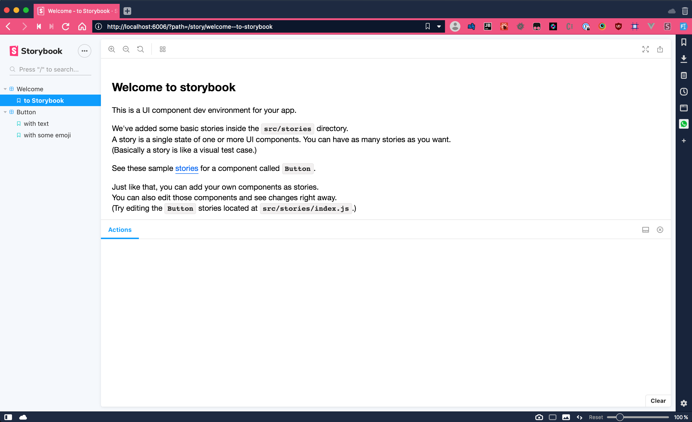
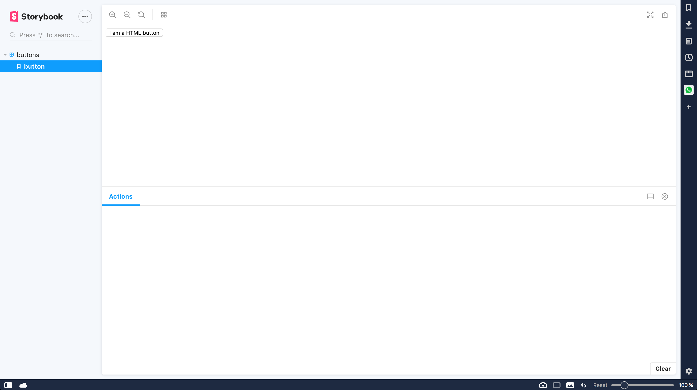

In this tutorial we're going to set up [Storybook](https://storybook.js.org/) with in a React project using [Typescript](https://www.typescriptlang.org/).

The aim is to make this tutorial accessible to developers that are both new to Storybook or Typescript.

## Creating a test project

For this tutorial I'll be creating a test project, if you're planning to add Storybook to an existing project you can safely skip this step.

Run the following command in your terminal to create a new React project with Typescript support;

```bash
❯ npx create-react-app myproject --typescript
```

_Note: You cannot use capitals in the name of your project, NPM prohibits this._

Whilst that's running feel free to grab a cup of coffee (or tea if that's your thing), this can take a while.

If everything went according to plan you should see something like this in your terminal;

```bash
npx: installed 91 in 6.012s

Creating a new React app in myproject.

Installing packages. This might take a couple of minutes.
Installing react, react-dom, and react-scripts...


> fsevents@1.2.9 install myproject/node_modules/chokidar/node_modules/fsevents
> node install

[fsevents] Success: "myproject/node_modules/chokidar/node_modules/fsevents/lib/binding/Release/node-v67-darwin-x64/fse.node" is installed via remote

> fsevents@1.2.9 install myproject/node_modules/jest-haste-map/node_modules/fsevents
> node install

[fsevents] Success: "myproject/node_modules/jest-haste-map/node_modules/fsevents/lib/binding/Release/node-v67-darwin-x64/fse.node" is installed via remote
+ @types/react-dom@16.8.4
+ @types/jest@24.0.12
+ react-scripts@3.0.0
+ react-dom@16.8.6
+ @types/react@16.8.16
+ @types/node@12.0.0
+ typescript@3.4.5
+ react@16.8.6
added 1541 packages from 783 contributors and audited 888974 packages in 93.724s
found 0 vulnerabilities

We detected TypeScript in your project (src/App.test.tsx) and created a tsconfig.json file for you.

Your tsconfig.json has been populated with default values.


Initialized a git repository.

Success! Created myproject at myproject
Inside that directory, you can run several commands:

  npm start
    Starts the development server.

  npm run build
    Bundles the app into static files for production.

  npm test
    Starts the test runner.

  npm run eject
    Removes this tool and copies build dependencies, configuration files
    and scripts into the app directory. If you do this, you can’t go back!

We suggest that you begin by typing:

  cd myproject
  npm start

Happy hacking!
```

_Note: It could be a little different depending on the latest version of `create-react-app` and your project name._

With that out of the way, let's get to installing Storybook 🎉️

## Installing Storybook

In this step we'll be installing Storybook, whether you have a new project or if you're adding Storybook to an existing project, the steps are the same.

To install Storybook we'll be following their documentation; [https://storybook.js.org/docs/guides/guide-react/](https://storybook.js.org/docs/guides/guide-react/).

To make things easy, the amazing people who built Storybook have provided us with an automated installer. All you have to do is run the following command in your project;

```bash
❯ npx -p @storybook/cli sb init --type react
```

This, again, is going to take a while.

When it's done you should have something like this in your terminal;

```bash
npx: installed 408 in 26.052s

WARNING: We noticed you're using the `useBuiltIns` option without declaring a core-js version. Currently, we assume version 2.x when no version is passed. Since this default version will likely change in future versions of Babel, we recommend explicitly setting the core-js version you are using via the `corejs` option.

You should also be sure that the version you pass to the `corejs` option matches the version specified in your `package.json`'s `dependencies` section. If it doesn't, you need to run one of the following commands:

  npm install --save core-js@2    npm install --save core-js@3
  yarn add core-js@2              yarn add core-js@3

[BABEL] Note: The code generator has deoptimised the styling of /Users/<your name>/.npm/_npx/3274/lib/node_modules/@storybook/cli/node_modules/lodash/lodash.js as it exceeds the max of 500KB.

 sb init - the simplest way to add a storybook to your project.

 • Installing Storybook for user specified project type. ✓
 • Adding storybook support to your "React" app. ✓
 • Preparing to install dependencies. ✓

added 309 packages from 520 contributors, updated 1 package and audited 908685 packages in 59.441s
found 0 vulnerabilities


 • Installing dependencies. ✓

To run your storybook, type:

   npm run storybook

For more information visit: https://storybook.js.org
```

_Note: It could be a little different depending on the latest version of `@storybook/cli` and your project name._

If you see the same massive warning as I did at the top, don't worry about it. The command you just ran automatically adds the needed dependencies and scripts for Storybook to work. Your `package.json` should now look something like this;

```json
{
    "name": "myproject",
    "version": "0.1.0",
    "private": true,
    "dependencies": {
        "@types/jest": "24.0.12",
        "@types/node": "12.0.0",
        "@types/react": "16.8.16",
        "@types/react-dom": "16.8.4",
        "react": "^16.8.6",
        "react-dom": "^16.8.6",
        "react-scripts": "3.0.0",
        "typescript": "3.4.5"
    },
    "scripts": {
        "start": "react-scripts start",
        "build": "react-scripts build",
        "test": "react-scripts test",
        "eject": "react-scripts eject",
        "storybook": "start-storybook -p 6006",
        "build-storybook": "build-storybook"
    },
    "eslintConfig": {
        "extends": "react-app"
    },
    "browserslist": {
        "production": [">0.2%", "not dead", "not op_mini all"],
        "development": ["last 1 chrome version", "last 1 firefox version", "last 1 safari version"]
    },
    "devDependencies": {
        "@storybook/react": "^5.0.11",
        "@storybook/addon-actions": "^5.0.11",
        "@storybook/addon-links": "^5.0.11",
        "@storybook/addons": "^5.0.11",
        "@babel/core": "^7.4.4",
        "babel-loader": "^8.0.5"
    }
}
```

_Note: It's possible that the versions are different._

We can now run Storybook with the following command;

```bash
❯ npm run storybook
```

Your browser should open and you should see the following;



If you don't, your terminal should now show you something like this;

```bash
╭──────────────────────────────╮
│                                                   │
│   Storybook 5.0.11 started                        │
│   14 s for manager and 13 s for preview           │
│                                                   │
│   Local:            http://localhost:6006/        │
│   On your network:  http://192.168.86.64:6006/    │
│                                                   │
╰──────────────────────────────╯
```

Open the `Local` link to open Storybook.

In the left bar you'll see some example stories that Storybook generates for you.

Using Typescript to configure Storybook

The config files for storybook itself are Javascript by default, to use Typescript for Storybook as well please read on.

In your project you'll notice there's a new folder; `.storybook`. It should contain 2 files;

### addons.js

Storybook automatically installs 2 addons when you first install it, this file registers said addons.

Addons allow you to add functionality to Storybook. This can be anything; from showing the source of a story (for easy copy pasting) to showing available props on components.

### config.js

This file configures how Storybook loads stories. By default Storybook loads every file that ends with `*.stories.js*`.

Rename both of these files so they have the `*.ts` extension so you can write TypeScript in them.

In `config.ts` change the following code;

```typescript
// automatically import all files ending in *.stories.js
const req = require.context("../stories", true, /\.stories\.js$/);
```

to

```typescript
// automatically import all files ending in *.stories.tsx
const req = require.context("../src/stories", true, /\.stories\.tsx$/);
```

_Note: Notice your stories will now be located inside `src/stories`, this is necessary because else Storybook wil not be able to open Typescript stories._

## Writing your first story

For this example we'll be writing a story for a `button`, I suggest you follow these steps with a component in your project so you can show it off to your team mates.

In the `stories` directory you'll notice there is a file called `index.stories.js`, this file contains the stories you saw when first opening Storybook.

Delete this file and create a new one; `myComponent.stories.tsx`, feel free to name it however you like.

Add the following contents;

```typescript
import { storiesOf } from "@storybook/react";
import * as React from "react";

const stories = storiesOf("buttons", module);

stories.add("button", () => <button>I am a HTML button</button>);
```

Ofcourse, you can replace `<button>I am a HTML button</button>);` with your actual component.

Restart Storybook and you'll now be able to see your story;



That's it! Time to celebrate! 🎉️
